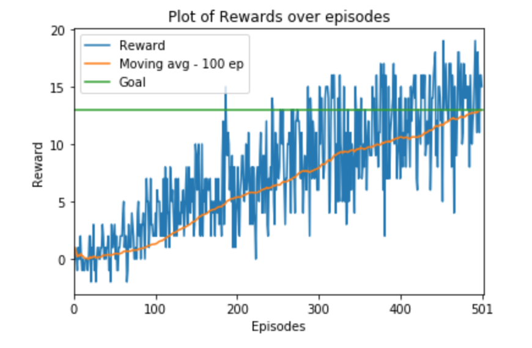

# Project Navigation Report

## Description

The goal of this project is to train an agent to gather yellow bananas while avoiding the blue ones. The agent recieves a vector of observations (37 features). The agent has to decide between one of the 4 discrete actions (forward, back, left right) to navigate in the environment. The episode ends if the agent touches the blue banana. The environment is solved when the agent reaches an average score of 13.0 on 100 consecutive episodes.

## Algorithm

I use vanilla Deep Q Learning algorithm to train the agent. The agent is a deep neural network with 3 hidden layers as described below:

- Input Layer    : 37 features
- Hidden Layer 1 : 64 neurons
- Hidden Layer 2 : 32 neurons
- Hidden Layer 3 : 8 neurons
- Output Layer   : 4 neurons representing 4 discreet actions

The model was trained for a maximum of 1000 epochs using Adam Optimizer with an initial learning rate of 0.0001. The model was trained to explore more during initial phase of training with epsilon set to 1 and gradually decaying it by 0.5% every epoch until it decayed upto 0.01 and then keping it fixed. The decay was introduced to account into the factor that the model learns to perform better as training progresses. So, in the later stages, the model can exploit the learnt state-action-observations discovered during exploration.

## Results

We can see (in the graph) that during the initial process of exploration, the model is learning slowly and getting less rewards at the begining. After a certain stage(around 125 epochs), when the model starts to exploit, the moving average of rewards shoots up. The model is able to acheive the goal(moving average of 13) in 501 epochs. 

## Future Work

The model could acheive the same score faster if we do some hyperparameter search. Similarly, I would also like to try out double DQN and dueling DQN. I would also like to explore if the vanilla model would perform better and train faster if we used a prioritized experience replay. I would also like to try out DQN with CNN on visual state space.
